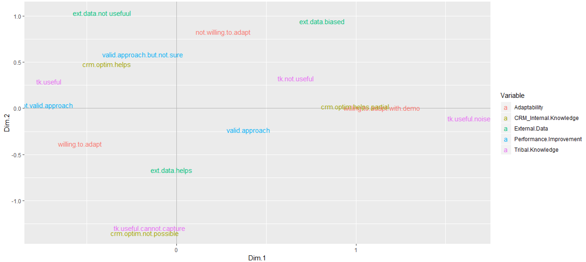

# Product Evaluation Using Focus Group Interview

## Objective
The goal of this study is to collect user preferances and feeback about product `A` through focus group discussions. The observations obtained from the discussions should be transformed to produce an emperical evidence of product features as perceived by the respondents. 

## Approach
From a group of `20` respondents, each respondent is asked to provide opinions on product features. The moderator and his/her team collects the opinion of each user through interactions. The survey should produce sufficient data to evalute the product usefulness based on user responses.

### Requirements
 * Moderator: `TBD`
 * Respondents: `20`
 * Time: `30-45 min`
 * Venue: `TBD`
 * Recording: `Yes`
 * Method: `Moderator-hosted open dicusssion`
 
### Assumptions
  Respondents are aware of product `A` features.

## Implementation
Before starting the session, the moderator should provide a brief introduction about the key features of product `A`. These primary features are the variables identified for the survey. 

**Note**: Generic questions are not included here. 

### Sample Questionnaire
* Product `A` increases sales success rate. Would you like to try?
  - `willing.to.adapt` I am convinced with the features. I want to try.
  - `not.willing.to.adapt` I don't agree with this product.
  - `willing.to.adapt.with.demo` I am interested, but I'd like to see the demo first.

* Do you think the Tribal knowledge captrued by the tool is useful?
  - `tk.useful` Yes, the learning from each transaction is a potential input for new leads. 
  - `tk.useful.cannot.capture` I don't think the tool can capture all details.
  - `tk.not.useful` Tribal knowledge is not reliable. 
  - `tk.useful.noise` Maybe it can capture, but that is not reliable as it may be associated with noise due to manual intervention.
  
* Do you think the tool scrapes CRM data to derive meaningful and useful suggestions? 
  - `crm.optim.helps` Yes, CRM data is reliable database with a lot of info. Structuring and channelising the data is possible with this tool. 
  - `crm.optim.not.possible` I don't think the tool can capture all details.
  - `crm.optim.helps.partial` Maybe it can capture, but not all info is useful for a successful deal.
  
* Do you think the data from external source increases sales efficiency? 
  - `ext.data.helps` Yes, external data is required to refine and derive accurate options.
  - `ext.data.not.useful` External data is not reliable. 
  - `ext.data.biased` I don't believe external data is useful. It poses high risks as it may be infludenced by different stakeholders.

* Product `A` improves sales performace with the approach described above.
  - `valid.approach` Yes, its a valid approach. I agree that key data inputs are considered here.
  - `not.valid.approach` No, this approach is not useful. 
  - `valid.approach.but.not.sure` Its a valid approach but not sure if this really helps. 
  
## Results

### Matrix Table

### Relationship Plot

## Conclusion

<to be added>
 
