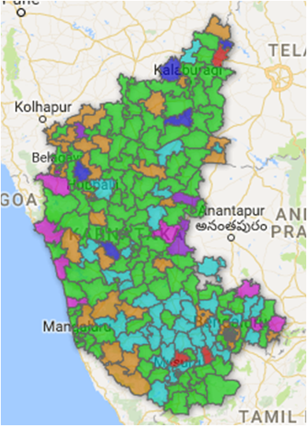
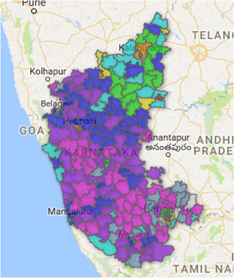

 
<body>

<h2>Karnataka Assembly Poll Results - 2013</h2> 

<iframe width="600" height="450" src="https://datastudio.google.com/embed/reporting/0B3XRb21GCZvLWG1TZEVMZ05jZlU/page/UUHJ" frameborder="0" style="border:0" allowfullscreen></iframe>

<h3>Constituency-Wise Results</h3>
<a target="_blank" href="./ka.html">
  
     
<h3>Polling Percentages</h3>
<a target="_blank" href="./ka_poll.html">
  
    

