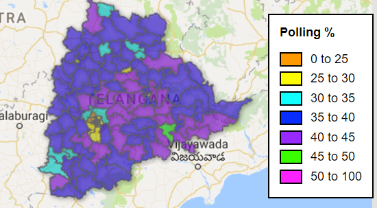

<h2>Karnataka Assembly Poll Results</h2> 
<h3>Constituency-wise Voting</h3>
<iframe width="600" height="450" src="https://datastudio.google.com/embed/reporting/0B3XRb21GCZvLTWZ3SVd3RXBtTWc/page/9XMJ" frameborder="0" style="border:0" allowfullscreen></iframe>

<h3>Winning Margin by Category and Party</h3>
<iframe width="600" height="450" src="https://datastudio.google.com/embed/reporting/0B3XRb21GCZvLNE13bG1IamU3S2s/page/2WMJ" frameborder="0" style="border:0" allowfullscreen></iframe>

<h3>Constituency-wise Polling Percentage </h3>
<a target="_blank" href="./ka_poll.html">
  
      
     
<h2>Telangana Assembly Poll Results</h2> 
<h3>Constituency-wise Voting</h3>
<iframe width="600" height="450" src="https://datastudio.google.com/embed/reporting/0B3XRb21GCZvLdDZWRzBxMkF2X1E/page/9XMJ" frameborder="0" style="border:0" allowfullscreen></iframe>

<h3>Winning Margin by Category and Party</h3>
<iframe width="600" height="450" src="https://datastudio.google.com/embed/reporting/0B3XRb21GCZvLVXFMdVltN3NVX2c/page/2WMJ" frameborder="0" style="border:0" allowfullscreen></iframe>

  <h3>Constituency-wise Polling Percentage </h3>
<a target="_blank" href="./ts_poll.html">
  
    
    

